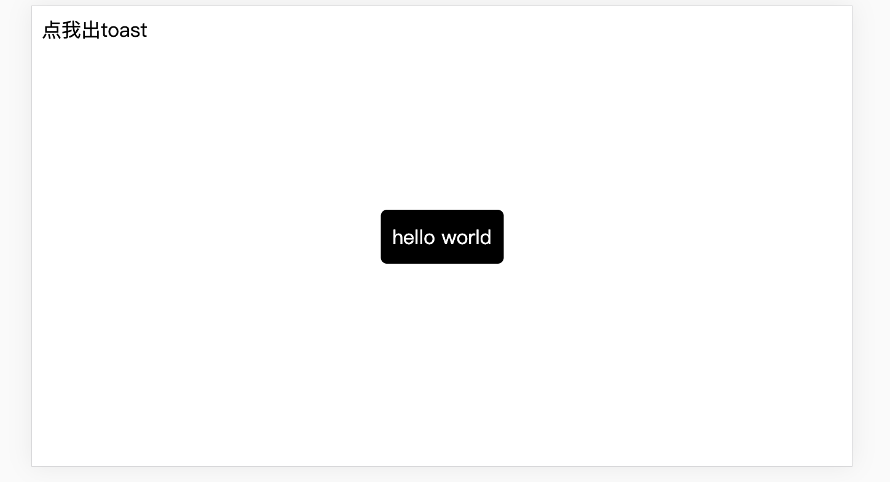

## 这是一个vue toast组件封装发布项目
安装依赖
```
npm i
```
编译打包
```
npm run build
```
打本地包验证
```
npm pack
```
发布npm
```
npm publish
```

### 具体流程写成了一篇博客
https://juejin.im/post/6867798692460494861/

封装发布组件是前端开发中非常重要的能力，通过对常用组件的封装可以提升团队开发的效率，避免重复劳作且不方便维护。好的组件的抽象和封装能让组件得到更广泛和多环境兼容的应用。       
本文讲述了如何一步步从0到1封装发布一个常用的toast组件的过程。<font color=#ff0505><b>本文是搭配实例书写的，所以理论上根据本文你可以自己成功打包发布一个自己的vue 组件。</b>   </font>   
<a href="#fulu">在文末有对应的项目地址可供参考。</a>

### 组件创建

创建一个空文件
```
mkdir ToastComponent
cd ToastComponent/
```
初始化一个package.json
```
npm init -y
```
代码如下：
```
{
  "name": "ToastComponent",
  "version": "1.0.0",
  "description": "",
  "main": "index.js",
  "scripts": {
    "test": "echo \"Error: no test specified\" && exit 1"
  },
  "keywords": [],
  "author": "",
  "license": "ISC"
}
```
新建一个src目录,里面写两个文件index.js 和 toast.vue,目录如下：
```
├── package.json
└── src/
     └── index.js
     └── toast.vue
```
toast.vue如下，一个单纯的vue文件
```
<template>
  <div class="toast">{{msg}}</div>
</template>
<script>
export default {
  name: "Toast",
  data() {
    return {
      msg: ""
    };
  }
};
</script>
<style scoped>
.toast {
  position: fixed;
  left: 50%;
  top: 50%;
  transform: translate(-50%, -50%);

  width: fit-content;
  height: 44px;
  background-color: rgba(0, 0, 0);
  display: flex;
  justify-content: center;
  align-items: center;
  padding-left: 10px;
  padding-right: 10px;
  color: #fff;
  border-radius: 5px;
}
</style>
```
index.js代码如下：
```

import Toast from './components/Toast.vue'

Toast.install = (Vue) => {
  Vue.prototype.$toast = (msg, duration) => {   //添加一个实例方法 这样全局的实例都可以调用$toast方法了 msg、duration是调用$toast时传入的两个参数
    if (!msg) {
      return;
    }
    duration = duration || 1500;  //如果不传toast持续时间则默认使用此时间
    const constroct = Vue.extend(Toast)  //构造器
    const instance = new constroct();   //创建实例
    instance.msg = msg || '';           //将$toast(msg,duration)中的msg传入组件的data中
    const tpl = instance.$mount().$el   //vue实例未挂载时可这样拿到它的dom 后续可对它的dom进行操作

    document.querySelector('body').appendChild(tpl);
    setTimeout(() => {
      document.querySelector('body').removeChild(tpl)
    }, duration);
  }
}

export default Toast;
```
### 组件打包
对组件进行编译打包，这里使用webpack,在跟目录下新建webpack.config.js,配置如下：
```
// webpack.config.js
const path = require('path')
const { VueLoaderPlugin } = require('vue-loader')

module.exports = {
  entry: {
    index: path.join(__dirname, "/src/index.js") // 入口文件（就是刚才用于暴露组件的index.js）
  },
  output: {
    path: path.join(__dirname, "/dist"), // 打包后的文件存放在dist文件夹
    publicPath: '/dist/', // 设置公共路径
    filename: "toast.js", // 打包后输出文件的文件设置为btn.js
    libraryTarget: 'commonjs2' // 这个选项会尝试把库暴露给前使用的模块定义系统，这使其和CommonJS、AMD兼容或者暴露为全局变量
  },
  module: {
    rules: [
      {
        test: /\.vue$/,
        loader: 'vue-loader'
      },
      // 它会应用到普通的 `.css` 文件
      // 以及 `.vue` 文件中的 `<style>` 块
      {
        test: /\.css$/,
        use: ['style-loader', 'css-loader']
      },
      // 它会应用到普通的 `.js` 文件
      // 以及 `.vue` 文件中的 `<script>` 块
      {
        test: /\.js$/,
        exclude: /node_modules|vue\/dist|vue-router\/|vue-loader\/|vue-hot-reload-api\//,
        use: {
          loader: 'babel-loader',
          options: {
            presets: ['@babel/preset-env']
          }
        }
      }
    ]
  },
  plugins: [
    new VueLoaderPlugin()   //这个插件是webpack打包.vue文件必须使用的 它的作用是将你定义的其他规则复制并运用到.vue文件里相应的块  如果你有一条匹配 /\.js$/ 的规则，那么它会应用到 .vue 文件里的 <script> 块。
  ]
}

```

对应的package.json 修改如下：
```
{
  "name": "toast-component",
  "version": "1.0.0",
  "description": "",
  "main": "dist/toast.js",
  "scripts": {
    "build": "webpack --mode production"
  },
  "keywords": [],
  "author": "",
  "license": "ISC",
  "devDependencies": {
    "@babel/core": "^7.11.5",
    "@babel/preset-env": "^7.11.5",
    "babel-loader": "^8.1.0",
    "css-loader": "^4.2.2",
    "style-loader": "^1.2.1",
    "vue-loader": "^15.9.3",
    "vue-template-compiler": "^2.6.12",
    "webpack": "^4.44.1",
    "webpack-cli": "^3.3.12"
  }
}
```

项目目录如下   
   
安装对应的依赖
```
npm i 
```
编译生成打包文件
```
npm run build
```
可见打包后的文件已生成   

### 测试验证组件是否正常
```
npm pack
```
可在目录中看到生成了一个.tgz的压缩包  
   
如何检测这个包呢？我们可以新建一个vue项目去验证。   
在此为了方便使用vue-cli新建一个test-toast项目.将刚才生成的压缩包放在test-toast目录的跟路径下：   

```
npm i toast-component-1.0.0.tgz
```
全局引入注册这个组件
```
//main.js

import Vue from 'vue'
import App from './App.vue'

import Toast from 'toast-component'
Vue.config.productionTip = false
//全局注册
Vue.use(Toast)

new Vue({
  render: h => h(App),
}).$mount('#app')
```

在项目中使用
```
//App.vue

<template>
  <div id="app">
    <div @click="showToast">点我出toast</div>
  </div>
</template>

<script>
export default {
  name: "App",
  components: {},

  methods: {
    showToast() {
      this.$toast("hello world", 2000);
    }
  }
};
</script>

```
运行点击按钮可以出现toast如下，可以自定义duration、msg

至此验证该组件通过，就回到组件开发项目就可以发布了。

### 发布
在组件项目中命令行运行：
```
npm publish
```
即可发布到npm。如需要登录可以运行：
```
npm login 
```
进行登录再操作。
发布成功的效果：

[就可以在npm平台看到该组件了](https://www.npmjs.com/package/toast-component)

### [附](#fulu)

[组件项目地址](https://github.com/lijieJack/toast-component)    
[测试组件效果项目地址](https://github.com/lijieJack/test-toast)


